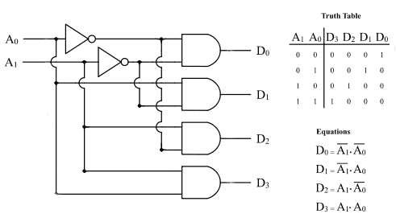
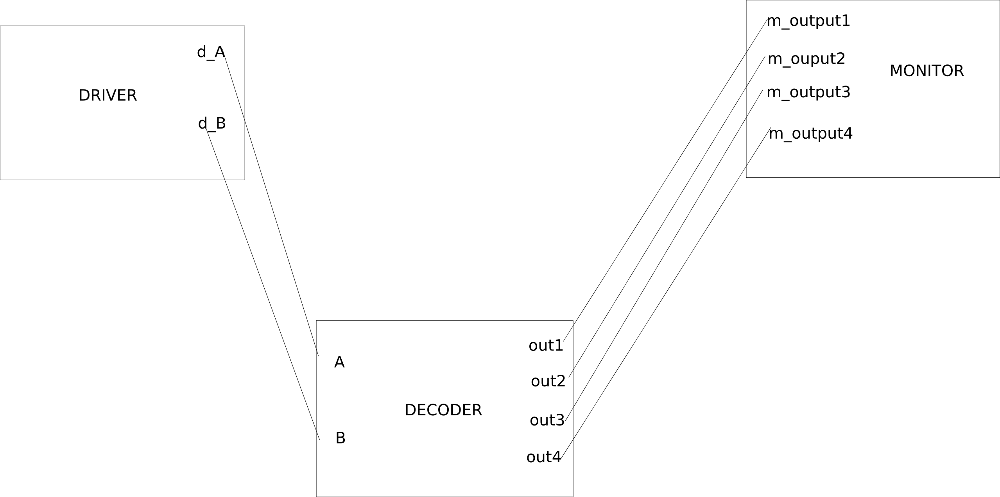
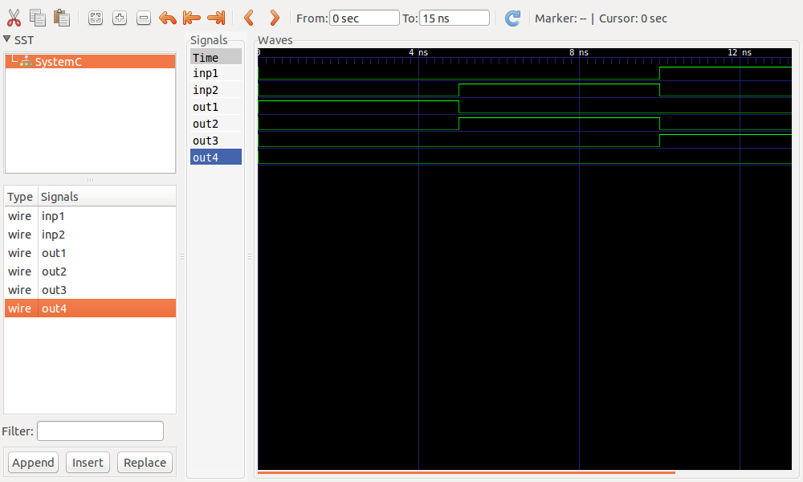
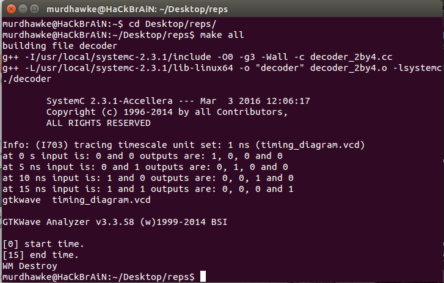

Name: Amos Cheruiyot 
Registration Number: i39/2479/2014

<u>2 BY 4 DECODER</u>

This is a 2-by-4 decoder tutorial,  which is a makefile project and so no need for an IDE. 
Just cd into this folder and run the command 

	make all

A line decoder is a device that changes the input code into a set of signals. For this reason it is also called a <i>demultiplexer</i>  
A two to four line decoder is of the form, two inputs and four outputs 

In the truth table above, we see that the 2 to four decoder takes 2 inputs: A and B, and from each of those combination of inputs,its able to determine four output signals. 

	
	<caption> A 2 by 4 decoder circuit.</caption>

The model of computation  for our decoder

	

<h3>Implementation</h3>
Using our model of computation, we implemented the decoder in systemc using code and simulation. 
Driver- Provided the 2 signals that were to be decoded. 
decoder-The signals from the driver were used as inputs and 		interpreted into output signals 
monitor- This module monitored output and input to inspect the functioning of the decoder model. 
By adding more inputs and more outputs, we were able to modify the 1by2 decoder to obtain this 2by4 decoder. 

The simulation  using GTK-Wave  :

	

The terminal output displayed:

	

<h4>conclusion</h4>
The results obtained from the simulation were same to those provided in the truth table of a 2by4 decoder.
The modelling and simulation of the 2by4 decoder was succesful.
